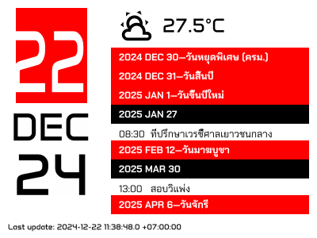

# Daily report display generator

This project is mainly for generating dynamic PNG image for my e-Paper display via ESPHome image.



This repository contains an application template built using [Axum](https://github.com/tokio-rs/axum) and [PostgreSQL](https://www.postgresql.org/). It serves as a starting point for creating a new Axum server.

Inspired by [Zero To Production In Rust](https://www.zero2prod.com) and [realworld-axum-sqlx](https://github.com/launchbadge/realworld-axum-sqlx).

The full list of crates used can be found in the [Cargo.toml](./Cargo.toml) file. However, here are some key ones:

* [Axum](https://github.com/tokio-rs/axum) - A user-friendly, modular web framework built with Tokio, Tower, and Hyper.
* [Sqlx](https://github.com/launchbadge/sqlx) - An asynchronous, pure Rust SQL crate that supports compile-time checked queries without a DSL. It supports PostgreSQL, MySQL, SQLite, and MSSQL.
* [Tracing](https://github.com/tokio-rs/tracing) - A framework for instrumenting Rust programs to collect structured, event-based diagnostic information.
* [Time](https://github.com/time-rs/time) - The most used Rust library for date and time handling.
* [Serde](https://serde.rs/) - A framework for efficiently and generically serializing and deserializing Rust data structures.
* [Uuid](https://github.com/uuid-rs/uuid) - A library for generating and parsing UUIDs.

## Getting Started

To begin with this project:

### Install `sqlx-cli`

SQLx offers a command-line tool for creating and managing databases as well as migrations. It is available on the Cargo crates registry as `sqlx-cli` and can be installed as follows:

```shell
cargo install sqlx-cli --features postgres
```

### Run Postgres

The most straightforward way to run Postgres is by using a container with a pre-built image. The command below will start latest version of Postgres using [Docker](https://www.docker.com/):

```shell
docker run -d -p 5432:5432 -e POSTGRES_PASSWORD=password postgres
```

### Clone this Repository

```shell
git clone https://github.com/koskeller/axum-postgres-template
cd axum-postgres-template
```

### Configure the Application

The backend application is preferably configured via environment variables. To simplify the process during development, we can use `.env` files to avoid defining the variables each time. As a starting point, you can simply copy the sample `.env` file in this repo and modify the `.env` file as per the comments therein.

```shell
cp .env.sample .env
```

### ICAL_*

These are URLs for iCal calendar for displaying on the right hand side.

#### ICAL_HOLIDAY

This is for displaying holiday (Red strip date)

Currently, I use [MyHora](https://www.myhora.com/calendar/ical.aspx) since it's syncronise with Thai government-sactioned holiday.

To change, just replace `ICAL_HOLIDAY` value with a URL to `ics` file.

#### ICAL_EVENT

This is for displaying event from calenday

To get URL, go to your calendar application and generate ICS calendar. ([Google](https://support.google.com/calendar/answer/37648?hl=en#zippy=%2Csecret-address), [Proton](https://proton.me/support/share-calendar-via-link#how-to-share-a-calendar-with-multiple-links))

### HA_*

This is for accessing HomeAssistant REST API

#### HA_URL

HomeAssistant root domain. Usually in `http://<IP/domain>:8123` *without trailing slash*.

#### HA_TOKEN

[HomeAssistant long-lived token](https://community.home-assistant.io/t/how-to-get-long-lived-access-token/162159/5).

### ACCESS_TOKEN

Just any abritarty string.

### Set Up the Application Database

With `sqlx-cli` installed and your `.env` file set up, you only need to run the following command to prepare the Postgres database for use:

```shell
sqlx db setup
```

### Sqlx offline mode

To avoid the need of having a development database around to compile the project even when no modifications (to the database-accessing parts of the code) are done, this projects enables "offline mode" to cache the results of the SQL query analysis using the sqlx command-line tool. See [sqlx-cli/README.md](https://github.com/launchbadge/sqlx/blob/main/sqlx-cli/README.md#enable-building-in-offline-mode-with-query) for more details.

```shell
cargo sqlx prepare
```

### Starting the Application

With everything else set up, all you need to do now is:

```shell
cargo run
```

### Autoreloading

To start the server and autoreload on code changes:

```shell
cargo install cargo-watch
cargo watch -q -x run
```

To format `.json` logs using [`jq`](https://github.com/jqlang/jq):

```shell
cargo watch -q -x run | jq .
```

## Example

```rust
#[derive(Serialize, Deserialize, Debug, Clone)]
pub struct ExampleReq {
    pub input: String,
}

#[derive(Serialize, Deserialize, Debug, Clone)]
pub struct ExampleResp {
    pub output: String,
}

pub async fn example(
    State(state): State<AppState>,
    req: Result<Json<ExampleReq>, JsonRejection>,
) -> Result<Json<ExampleResp>, ApiError> {
    // Returns ApiError::InvalidJsonBody if the Axum built-in extractor
    // returns an error.
    let Json(req) = req?;

    // Proceed with additional validation.
    if req.input.is_empty() {
        return Err(ApiError::InvalidRequest(
            "'input' should not be empty".to_string(),
        ));
    }

    // Anyhow errors are by default converted into ApiError::InternalError and assigned a 500 HTTP status code.
    let data: anyhow::Result<()> = Err(anyhow!("Some internal error"));
    let data = data?;

    let resp = ExampleResp {
        output: "hello".to_string(),
    };
    Ok(Json(resp))
}
```

## Usage

In ESPHome, Set URL secret as `http://<domain>:<port>/epaper_page?token=<ACCESS_TOKEN>`. Then, set ESP device as shown in [esphome.yaml](./esphome.yaml).

## Contributing

Contributions are always welcome! Feel free to check the current issues in this repository for tasks that need attention. If you find something missing or that could be improved, please open a new issue.

## Legal

This project use:

* [Material Design Icon](https://github.com/google/material-design-icons/blob/master/LICENSE)
* [Google font](https://fonts.google.com) Anta, and Chakra
